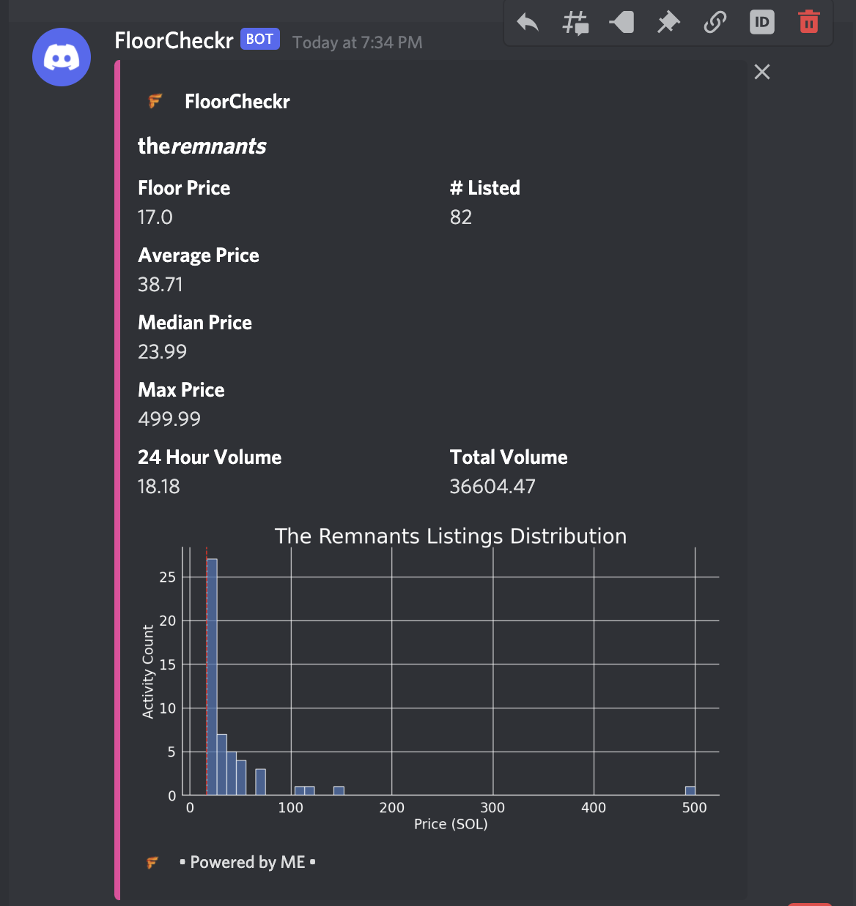

# floorcheckr

## Services Used
[Google Cloud Functions](https://cloud.google.com/functions)
[MagicEden API](https://api.magiceden.dev/)

Assumptions
- You must have creds for GCP Console
- Sufficient IAM/Permission to deploy Cloud Function
- [Authenticated](https://cloud.google.com/sdk/gcloud/reference/auth/login) into GCP Console (`gcloud auth login`)

1. Clone Repo
2. Create [Python Virtual Env](https://docs.python.org/3/library/venv.html)

```
python3 -m venv MY-ENV-NAME
```
3. Install Packages

```
pip install -r requirements.txt
```
4. Deploy Cloud Function

- make sure you're authenticated via terminal to your gcp project
- make sure you or the Service Account has proper IAM permissions

```
gcloud functions deploy MY-CLOUD-FUNCTION-NAME 
  --entry-point=main 
  --runtime python38 
  --trigger-http 
  --allow-unauthenticated
```
5. Go into GCP console and test it out!

- Serverless function expects `symbol` and `webhook_url`

symbol: Symbol of your NFT project (can be found using MagicEden's All Collections API endpoint or the last part of the URL when navigating to the page on ME website.

eg. https://magiceden.io/marketplace/the_remnants_ (symbol for this link is "the_remnants_") 

webhook_url: Learn more on [Discord's website](https://support.discord.com/hc/en-us/articles/228383668-Intro-to-Webhooks)

Example payload:

```
{
    "symbol": "the_remnants_",
    "webhook_url": "https://discord.com/api/webhooks/953827191945306133/RHiRdgf_3k627XK50_2VrqEmETqvltJ7e5EE3yXvpSXz62WnzQ3mBvAS0ipSRGdhYZl6"
}
```

Example Request:

```
curl -X POST https://us-central1-<PROJECT>.cloudfunctions.net/test -d '{"symbol":"the_remnants_", "webhook_url": "https://discord.com/api/webhooks/12345/abcd"}'
```

Example Output:

